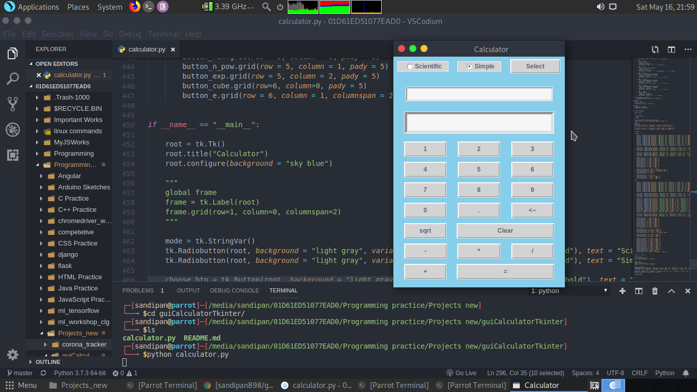
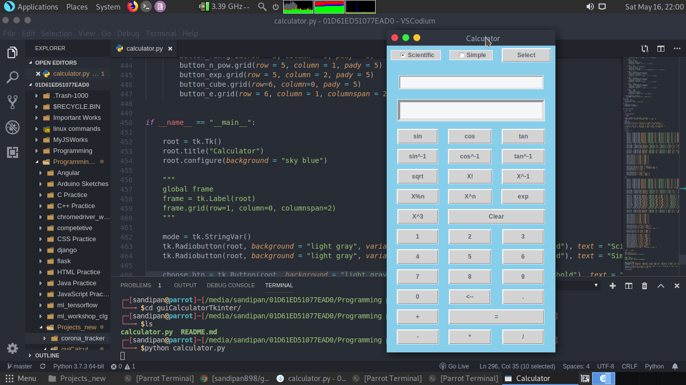

# Calculator Project
This a project to make a GUI calculator using python tkinter
It has two interfaces: one for Scientific operations and one for simple operations.
User can switch between the the two modes of the calculator

## Libraries used
1. tkinter
2. math

## Simple mode

## Scientific mode

